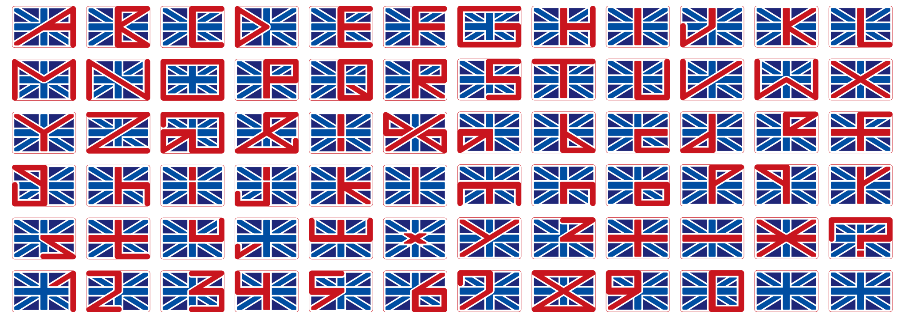

# UnionJack
OpenType font named “Union Jack”.

[Download](https://github.com/dainippon-type/UnionJack/releases)

This font is made in one colour. if you need some colours as a UK flag, you can make these font outline (ex: using Adobe Illustrator or some applications) and paint them.

(c) 2002–2016 dainippon type organization. all rights reserved. http://dainippon.type.org/
